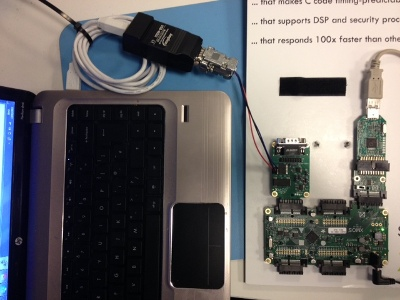
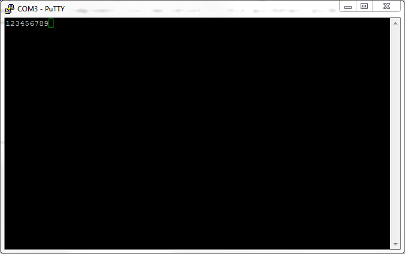
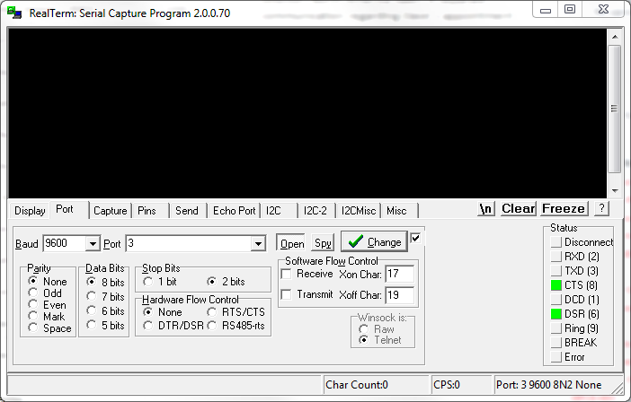

RS485 Terminal Console Demo Quickstart Guide
============================================

.. _Slicekit_RS485_Quickstart:

This simple demonstration of the RS485 transceiver component uses the XA-SK-ISBUS sliceCARD to:

   * Receive RS485 data packets sent from a terminal console via a USB-to-RS485 converter
   * Add +1 to the received characters and transmit the received packet back to the RS485 bus and thus back to the terminal console

Hardware Setup
++++++++++++++

The XP-SKC-L16 sliceKIT Core board has four slots with edge connectors: ``SQUARE``, ``CIRCLE``, ``TRIANGLE`` and ``STAR``. 

To setup up the system:

   #. Connect XA-SK-ISBUS sliceCARD to the XP-SKC-L16 sliceKIT Core board using the connector marked with the ``TRIANGLE``.
   #. Connect a USB to RS485/USB converter pins to header P1 on the ISBUS slice as follows: A (pin 1), B (pin 2) and GND (pin 3). 
   #. Connect the XTAG Adapter to sliceKIT Core board, and connect XTAG-2 to the adapter. 
   #. Connect the XTAG-2 to host PC. Note that a USB cable is not provided with the sliceKIT starter kit.
   #. Switch on the power supply to the sliceKIT Core board.

   Hardware Setup for RS485 Demo
   
	
Import and Build the Application
++++++++++++++++++++++++++++++++

   #. Open xTIMEcomposer and open the edit perspective (Window->Open Perspective->XMOS Edit).
   #. Locate the ``RS485 Terminal Console Demo`` item in the xSOFTip pane on the bottom left of the window and drag it into the Project Explorer window in the xTIMEcomposer. This will also cause the modules on which this application depends (in this case, module_rs485) to be imported as well. 
   #. Click on the app_rs485 item in the Explorer pane then click on the build icon (hammer) in xTIMEcomposer. Check the console window to verify that the application has built successfully.

For help in using xTIMEcomposer, try the xTIMEcomposer tutorials, which you can find by selecting Help->Tutorials from the xTIMEcomposer menu.

Note that the Developer Column in the xTIMEcomposer on the right hand side of your screen provides information on the xSOFTip components you are using. Selecting either the ``RS485 transceiver component`` or ``RS485 Terminal Console Demo`` component in the xSOFTip Browser will cause a page with links to both the component and application quickstart documentation to be displayed in the Developer Column Window. Once you have briefly explored the component documentaion, you can return to this quickstart guide by re-selecting the ``RS485 Terminal Console Demo Quickstart Guide`` link.
    
Serial Terminal Setup Examples
++++++++++++++++++++++++++++++

You will need to use a Serial Terminal on the PC to send and receive the data. Below are examples of two clients showing how they should be configured: PuTTY and RealTerm.

PuTTY
.....

   #. Open the PuTTY program, the PuTTY Configuration Dialog should be showing
   #. Select the 'Serial' category, under 'Connection'
   #. Set the 'Serial line to connect to' to match the COM port associated with the USB to RS485 device (this can be found in the device manager if not known)
   #. Set the 'Speed (baud)' option to 9600.
   #. Set the 'Data bits' option to 8
   #. Set the 'Stop bits' option to 2
   #. Select 'None' from the 'Parity' drop-down
   #. Select 'None' from the 'Flow control' drop-down
   #. Select the 'Session' Category
   #. Select the 'Serial' radio button 
   #. Click 'Open'
   #. Type 012345678 in to the terminal window, you should see the output as below
   
.. figure:: images/PuTTY_Config.PNG
   :align: center

   PuTTY Configuration Dialog
   

   
   PuTTY Terminal Output
   
RealTerm
........
   
   #. Open the RealTerm program
   #. Select the 'Port' tab
   #. Select '9600' (or whatever baud has been selected in the software)from the 'Baud' drop-down
   #. Select the COM port allocated to the USB to RS485 device from the 'Port' drop-down
   #. Select the 'None' radio button in the 'Parity' group
   #. Select the '8 bits' radio button in the 'Data Bits' group
   #. Select the '2 bits' radio button in the 'Stop Bits' group
   #. Select the 'None' radio button in the 'Hardware Flow Control' group
   #. Click the 'Change' button
   #. Select the 'Display' tab
   #. Click in the terminal window and type 012345678, you should see the output as below
   

   RealTerm Configuration Dialogue
   
.. figure:: images/RealTerm_Result.PNG
   :align: center
   
   RealTerm Terminal Output

Run the Application
+++++++++++++++++++

Now that the application has been compiled, the next step is to run it on the sliceKIT Core Board using the tools to load the application over JTAG (via the XTAG-2 and XTAG Adaptor card) into the xCORE multi-core micro-controller.

   #. Click on the ``Run`` icon (the white arrow in the green circle). A dialogue will appear asking which device to connect to. Select ``XMOS XTAG2``. 
   #. Using a serial terminal application, connect to the RS485 to USB converter, set to 9600 baud, 8 data bits, 2 stop bits, no parity.
   #. Once you are ready to run the demo click in the terminal window and type 012345678. The XMOS application receives each byte and increments it by one, so you will see 123456789 echoed back on the terminal window.

Next Steps
++++++++++

Look at the Code
................

   #. Examine the application code. In xTIMEcomposer navigate to the ``src`` directory under app_rs485 and double click on the app_rs485.xc file within it. The file will open in the central editor window.
   #. Find the main function and note that it runs the run_rs485() function on a single logical core, and a second application function on a second logical core.
   #. At the top of the application code file try changing the baud rate definition to a different value, change the baud rate in your chosen terminal application and reconnect.
   #. Find the application function. Note that the function waits for the rs485_run function to send it some data, buffer that data and then transmit the packet back. Try manipulating the data before returning it, eg. repeat it.

:ref:`Slicekit_RS485_Quickstart`
   
