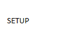

RS485 Demo Quickstart Guide
===========================

.. _Slicekit_GPIO_Simple_Demo_Quickstart:

RS485 demo app : Quick Start Guide
----------------------------------

This simple demonstration of xTimeComposer Studio functionality uses the XA-SK-ISBUS Slice Card together with the xSOFTip rs485 component to:

   * Receive RS485 data packets
   * Transmit the received packet back to the RS485 bus

Hardware Setup
++++++++++++++

The XP-SKC-L2 Slicekit Core board has four slots with edge conectors: ``SQUARE``, ``CIRCLE``, ``TRIANGLE`` and ``STAR``. 

To setup up the system:

   #. Connect XA-SK-ISBUS Slice Card to the XP-SKC-L2 Slicekit Core board using the connector marked with the ``TRIANGLE``.
   #. Connect a USB to RS485 converter pins A, B and GND to the ISBUS slice P1 connector.
   #. Connect the XTAG Adapter to Slicekit Core board, and connect XTAG-2 to the adapter. 
   #. Connect the XTAG-2 to host PC. Note that a USB cable is not provided with the Slicekit starter kit.
   #. Switch on the power supply to the Slicekit Core board.

   Hardware Setup for RS485 Demo
   
	
Import and Build the Application
++++++++++++++++++++++++++++++++

   #. Open xTimeComposer and open the edit perspective (Window->Open Perspective->XMOS Edit).
   #. Locate the ``'Slicekit RS485 Demo'`` item in the xSOFTip pane on the bottom left of the window and drag it into the Project Explorer window in the xTimeComposer. This will also cause the modules on which this application depends (in this case, module_rs485) to be imported as well. 
   #. Click on the app_rs485 item in the Explorer pane then click on the build icon (hammer) in xTimeComposer. Check the console window to verify that the application has built successfully.

For help in using xTimeComposer, try the xTimeComposer tutorials, which you can find by selecting Help->Tutorials from the xTimeComposer menu.

Note that the Developer Column in the xTimeComposer on the right hand side of your screen provides information on the xSOFTip components you are using. Select the ``RS485`` component in the xSOFTip Browser, and you will see its description together with links to more documentation for this component. Once you have briefly explored this component, you can return to this quickstart guide by re-selecting  ``'Slicekit RS485 Demo'`` in the xSOFTip Browser and clicking once more on the Quickstart  link for the ``RS485 Demo Quickstart``.
    

Run the Application
+++++++++++++++++++

Now that the application has been compiled, the next step is to run it on the Slicekit Core Board using the tools to load the application over JTAG (via the XTAG2 and Xtag Adaptor card) into the xCORE multicore microcontroller.

   #. Click on the ``Run`` icon (the white arrow in the green circle). A dialog will appear asking which device to cvonnect to. Select ``XMOS XTAG2``. 
   #. Using a serial terminal application, connect to the RS485 to USB converter, set to 9600 baud, 8 data
   bits, 2 stop bits, no parity.
   #. Send text via the terminal application, this will be echoed by the application on the Core Board.
    
Next Steps
++++++++++

Look at the Code
................

   #. Examine the application code. In xTIMEcomposer navigate to the ``src`` directory under app_rs485 and double click on the app_rs485.xc file within it. The file will open in the central editor window.
   #. Find the main function and note that it runs the run_rs485() function on a single logical core, and a second consume function on a second logical core.
   #. Find the consume function. Note that the function waits for the rs485_run function to send it some data, buffer that data and then transmit the packet back. Try manipulating the data before returning it, eg. repeat it.

:ref:`Slicekit_GPIO_COM_port_Demo_Quickstart`
   
